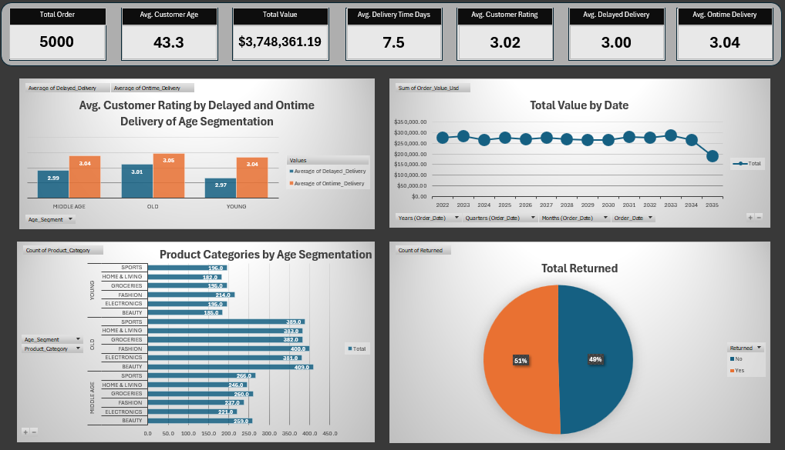

# Ecommerce_Age_Segmentation_Analysis
This project was developed to identify low profit margins by segmenting customers into age groups and to optimize marketing strategies.

---

---

## Main Results
* Looking at the average customer ratings for delayed orders by age group, the lowest rates are found in the young (2.97) and middle-aged (2.99) groups. Given that the overall rating is 3.02, 2.97 and 2.99 are not extreme figures. It could be argued that young and middle-aged groups are more impatient than the older group, but the main point to consider is that order delays are not the only factor affecting customer ratings. Other factors contributing to these low ratings should be examined. Examples include incorrect products, faulty or broken products, pricing, shipping, etc.
* The total value over the years appears stable. (The last year is omitted as it is incomplete.) The business has reached saturation and stagnated. The business needs to take various risks to increase its market share.
* Looking at product preferences by age group, we primarily serve the older group. Various campaigns and advertisements could be implemented to include the younger group in the ecosystem.
* Product categories are evenly distributed across all age groups. There are no extreme values. The same product groups have been served for 12 years. Different product groups can be introduced to the market for diversification.
* The total return rate is 51%, which is a significant figure for the business. This cannot be explained solely by delayed orders. Other factors need to be seriously examined.

---

## Project Workflow and Methodology
1. Data Collection and Initial Preparation (ETL)
Data Acquisition: Raw data was imported from the CSV source into a structured Excel environment.

Environment Setup: A multi-layered workbook structure (Source, Discovery, Calculation, and Dashboard) was created to maintain data integrity and separate "raw" data from "processed" insights.

2. Data Cleaning and Discovery (EDA)
Structural Organization: Excel Tables and Named Ranges were implemented to enable dynamic data referencing.

Numerical Data: Empty cells in currency and numeric fields were preserved to prevent calculation bias.

Exploratory Analysis: Orders exceeding 7 days were considered delayed. 3 age group segmentation was performed; young, middle age, and old. 30<45<+

3. Feature Engineering and Financial Modeling
Derived Columns: Custom formulas were developed to calculate the following:

Delivered_Date: Date the order arrived.

Age_Segment: Customer age segmentation.

Delayed_Delivery: Rating of delayed orders.

Ontime_Delivery: Rating of on-time orders.

4. Advanced Customer Age Segmentation
Profit-Based Layers: Customers were divided into Young, Middle Age, and Old age categories using nested logical functions.

5. Data Visualization and Reporting (To Be Delivered)
Dynamic Pivot Tables: Trends and ratings by age group were summarized. Sales trend and return percentage were summarized.

Interactive Dashboard: A professional dashboard was created including the following:

Executive KPIs: Key KPIs, customer ratings by age group, total value by date, product categories by age group, and total returned.

Insight Communication: Strategic recommendations based on age groups and other trends were documented in a final "Results" report.

---

## Tools & Technologies

* Pivot Tables
* Charts
* Tables, Named Ranges, Conditional Formatting
* Logical Expressions
* Advanced Dashboard

---

## Sources

* Supermarket_Sales.csv in datasource
* dashboard.png in dashboard
